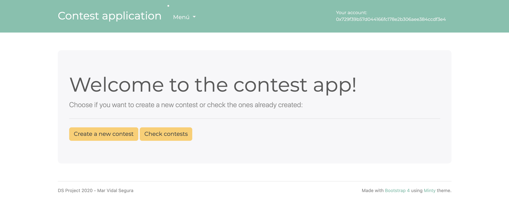
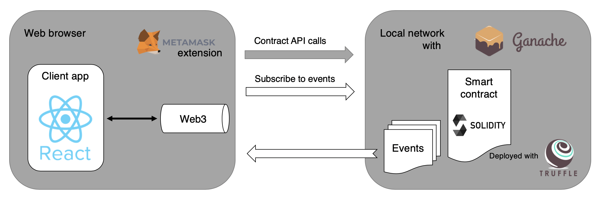

# Dapp for contest application
### Smart contract and webapp implementation

> Project for the [Decentralized Systems course](https://www.fib.upc.edu/en/studies/masters/master-innovation-and-research-informatics/curriculum/syllabus/DS-MIRI)
 
## Introduction
Development of a smart contract and a webapp for contest application. The project comes from the motivation about providing a more reliable, cheaper and faster way to create contests without the middle institution, in this case, a notary. 

## Technologies used
Blockchain smart contracts implementation and testing:
* Solidity
* Remix

Web application and blockchain integration:
* Web3JS
* Ganache
* Truffle
* Metamask

Web applications development:
* React
* Bootstrap

## Project architecture
The local network is set up with Ganache. The smart contract is developed with Solidity and compiled and deployed with Truffle.
The client app is developed with React and using the Web3JS libraries. The browser has installed the Metamask extension to be able to make the blockchain transactions.
The interaction between the app and the blockchain is made by the connection of Web3JS and the Metamask wallet to local network. This connections allow the transactions and communication with the deployed smart contract.

